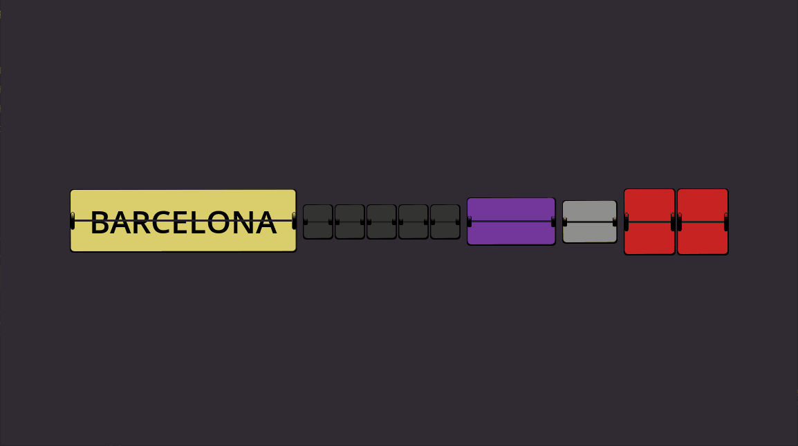

#  Split Flaps Label

A control node that displays text like a split-flap board. The node iterates through a list of characters until it reaches the desired one, making a clicky, satisfactory sound.

